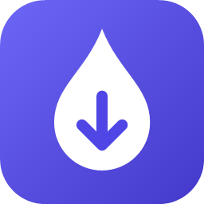

<p align="center"></p>

<h1 align="center">Dropper</h1>

<p align="center">
Send files, APKs, photos, links and text between your Windows PC, your Android phone and your other PCs.<br>
Over your own network only. No cloud, no account, no port open to the internet.
</p>

<p align="center">
<a href="https://github.com/C-Squared-Solutions-LLC/dropper/releases/latest"></a>
<a href="LICENSE"></a>
</p>

---

Drop a file on the window and it shows up on your phone. Share something on the
phone and it lands in `Downloads\Dropper` on the PC. The two devices pair once
with a QR code. After that every connection is mutually authenticated TLS 1.3,
and both keys live in hardware. Two PCs pair the same way without the camera:
each screen shows a 6-digit code, and you approve on both.

| | Windows | Android |
|---|---|---|
| **Send** | Drag & drop onto the window · *Choose files / folder* (folders get zipped) · **Send clipboard** (text, links, screenshots, copied files) · type a message · Explorer → *Send to → Dropper (phone)* · tray menu | **Share → Dropper** from any app · *Files* / *Photos* / *Clipboard* · type a message |
| **Receive** | Files land in `Downloads\Dropper`, tagged as downloaded so SmartScreen and Office Protected View still apply. Text and links are copied to the clipboard. You get a notification. | Files land in `Download/Dropper`. APKs open straight in the system installer. Text gets *Copy* / *Open link* buttons. |
| **Runs** | Tray app; can start with Windows | Background service with a silent notification |

## Download

Grab both from the [latest release](https://github.com/C-Squared-Solutions-LLC/dropper/releases/latest):

- `Dropper-<version>-windows-x64.zip`: the Windows app and its installer
- `Dropper-<version>.apk`: the Android app (Android 13+)

Each release lists SHA-256 checksums. Check them before installing.

## Install

### Windows 10/11

Windows 11 does everything. On Windows 10, Dropper can pair only with other PCs,
over TLS 1.2 with your consent on both PCs. It can't pair a phone, because phones
require TLS 1.3, which Windows 10 doesn't have.

1. Install the [.NET 8 Desktop Runtime](https://dotnet.microsoft.com/download/dotnet/8.0) if you don't have it:
   `winget install Microsoft.DotNet.DesktopRuntime.8`
2. Unzip the release and run, in that folder:
   ```powershell
   powershell -ExecutionPolicy Bypass -File install.ps1
   ```
   This installs to `%LOCALAPPDATA%\Programs\Dropper` and adds a Start menu entry
   plus *Send to → Dropper (phone)*. It also starts Dropper in the tray at sign-in,
   and adds firewall rules that accept **only your local subnet on Private
   networks**. That last step needs one admin (UAC) prompt.
   Flags: `-NoStartup`, `-NoSendTo`, `-NoFirewall`, `-NoLaunch`.

The executable isn't code-signed yet, so SmartScreen may say "Windows protected
your PC". Choose *More info → Run anyway*, after checking the checksum.

To remove it: `powershell -ExecutionPolicy Bypass -File uninstall.ps1`. Add
`-RemoveData` to also delete settings, history and the PC's identity key.

### Android

The app isn't on Google Play yet, so install the APK directly:

- **On the phone:** download the APK, open it, and allow your browser or Files app to install unknown apps.
- **From the PC with USB debugging:** `adb install Dropper-<version>.apk`

### Pair (once)

1. On the PC, click **Pair a device**. A QR code appears; it's valid for 3 minutes and works once.
2. On the phone, open Dropper → **Scan QR code**.
3. Both screens show the same 6-digit code. If they match, click **Codes match · Approve** on the PC.

**PC to PC** (both on the same network, both running Dropper):

1. On the first PC: **Pair a device** → **Another PC** → **Let another PC find this one**.
2. On the second PC: **Pair a device** → **Another PC** → **Find PCs** → **Pair**.
3. Both PCs show a 6-digit code. If the codes are the same, approve on **both**.

After pairing, the main window has a device picker. Choose where to send, and
either PC can send to the other.

Then, on the phone, open Dropper → Settings → *Background reliability* → **Allow**.
On Samsung, also add Dropper to Settings → Battery → *Background usage limits* →
**Never sleeping apps**. Otherwise the OS pauses it and items wait until you open
the app.

## Security

The short version:

- **QR pairing.** The phone learns the PC's exact public key from the QR code,
  and you confirm a 6-digit code on both screens. There's no trust-on-first-use.
- **PC-to-PC pairing by code comparison.** One PC commits to its random value
  before it sees the other's, so someone in the middle can't pick values that
  make the two codes match. Both users must approve.
- **TLS 1.3, both ways pinned.** Each side accepts only the key it paired with.
  Windows 10 has no TLS 1.3, so a Windows 10 PC can pair with another PC over
  TLS 1.2, but only if you tick *Allow TLS 1.2 for this PC* on **both** PCs. It
  can't pair a phone.
- **Hardware keys.** The PC's identity key lives in the TPM; the phone's in the
  Android Keystore (TEE). Neither can be exported.
- **Silent to strangers.** A connection has to open with an HMAC "knock" that only
  paired devices can produce, before the PC parses a single TLS byte. Discovery
  packets work the same way.
- **LAN only.** Dropper listens only on physical Ethernet/Wi-Fi adapters, on
  networks Windows marks Private, and accepts only peers from that subnet. VPN,
  Tailscale and WSL adapters are ignored, and so are Public networks.
- **Careful receiving.** File names are sanitized. Shortcut-type files are
  neutralized. Nothing opens by itself. The phone's share screen always asks before
  sending.

[SECURITY.md](SECURITY.md) has the full threat model, the cryptography, and the
results of an independent review. [docs/PROTOCOL.md](docs/PROTOCOL.md) is the wire
protocol.

Found a vulnerability? Report it privately through the repo's **Security** tab
(*Report a vulnerability*), not in a public issue.

## Troubleshooting

| Problem | Fix |
|---|---|
| Phone stays *Offline* | Both devices must be on the same network, and not a guest network. Guest networks and some mesh routers block devices from seeing each other ("AP isolation"). |
| Still offline | On the PC: Settings → Network → **Allow on local network…** (firewall). Dropper won't listen on networks Windows marks **Public**. If yours is home Wi-Fi, set it to Private: Settings → Network & internet → your connection. |
| PC's IP changed | Nothing to do. The phone finds the PC again through authenticated discovery (UDP 47823). |
| Tapping an APK does nothing | Allow *Install unknown apps* for Dropper when Android asks. |
| "clock difference" in the log | Connections are refused when the phone and PC clocks differ by more than 10 minutes. Turn on automatic time on both. |
| Lost the phone | PC → Settings → Paired devices → **Remove**. It's locked out immediately. |

Logs are in `%LOCALAPPDATA%\Dropper\dropper.log`. They never contain file contents, text or keys.

## Building from source

```
docs/PROTOCOL.md        wire protocol both apps implement
docs/test-vectors.json  byte-exact vectors from tools/gen_test_vectors.py (independent Python reference)
pc/Dropper.Core         engine: identity (CNG/TPM), TLS server, pairing, discovery, transfers
pc/Dropper.App          WPF app: window, tray, pairing, settings, Explorer integration
pc/Dropper.Tests        xUnit: vectors, input safety, end-to-end security tests against a fake phone
pc/Dropper.TestHost     headless engine on loopback for emulator tests (not shipped)
android/                Kotlin + Jetpack Compose app (see android/README.md)
```

**Windows.** Needs the .NET 8 SDK.

```powershell
dotnet test pc\Dropper.Tests                         # 103 tests
powershell -ExecutionPolicy Bypass -File pc\install.ps1   # builds and installs
```

**Android.** Needs JDK 17+ (Android Studio's bundled JBR works) and the Android SDK.

```powershell
cd android
.\gradlew testDebugUnitTest assembleDebug     # debug build, includes a test-only hook
.\gradlew assembleRelease                     # signed only if a signing key is set up
```

Release signing reads `keystore.properties` from `%USERPROFILE%\.dropper\signing`,
or from `DROPPER_SIGNING_DIR`. Neither lives in this repo. Release and Play steps
are in [PUBLISHING.md](PUBLISHING.md).

**Developer mode.** Set `DROPPER_DEV_LOOPBACK=1` to run the Windows app on
loopback only, with its own data folder and key. QR codes then point at
`10.0.2.2`, the Android emulator's address for the host.

## License

[MIT](LICENSE) © C-Squared Solutions LLC
